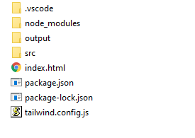

# Tailwindcss Install with Tailwind CLI
### Node.js >= 12.3.0
### node -v
chek node version
### npm init -y 
### npm i -D tailwindcss
### Install Tailwind CSS Intellisence VS Plugin 
### npx tailwindcss init 
 create tailwind.config.js
 
### create output and src folder.
### .src/tailwind.css
@tailwind base;
@tailwind components;
@tailwind utilities;

### create .vscode/settings.json
{
    "css.validate": false,
    "tailwind.emmetCompletions": true
}

### package.json

{
  "name": "tailwindstart",
  "version": "1.0.0",
  "description": "",
  "main": "index.js",
  "scripts": {
    "build": "tailwindcss -i ./src/tailwind.css -o ./output/tailwind.css -w"
  },
  "keywords": [],
  "author": "",
  "license": "ISC",
  "devDependencies": {
    "tailwindcss": "^2.2.19"
  }
}

### create index.html and link ./output/tailwind.css

<!DOCTYPE html>
<html lang="en">
<head>
    <meta charset="UTF-8">
    <meta http-equiv="X-UA-Compatible" content="IE=edge">
    <meta name="viewport" content="width=device-width, initial-scale=1.0">
    <title>Tailwind CSS</title>
    <link rel="stylesheet" href="./output/tailwind.css">
</head>
<body>
    

        hello
    

</body>
</html>

### npm run build 

## File and folder structure

